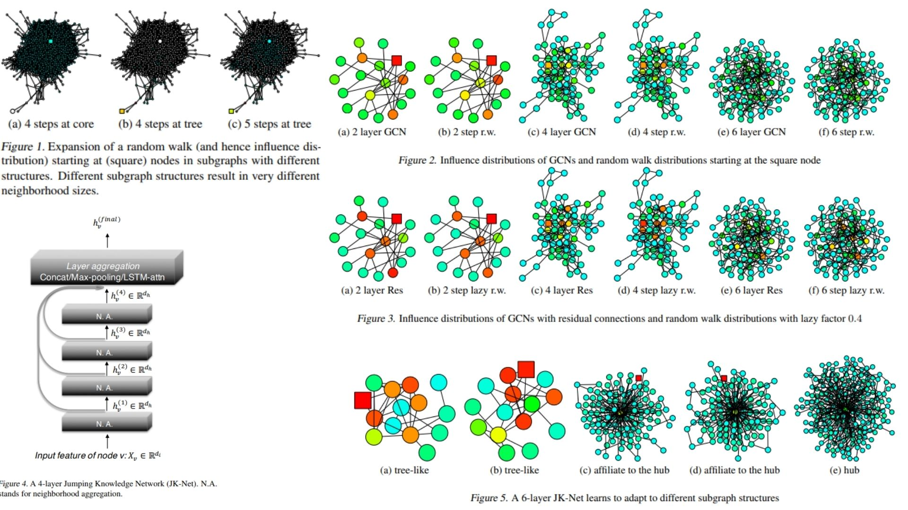

# 🤡 JKNet-Replication — Jumping Knowledge Graph Representation Learning

This repository provides a **forward-only PyTorch replication** of the  
**Jumping Knowledge Network (JK-Net)** architecture for graph representation learning.

The focus is on **faithful reproduction of the paper’s mathematical formulation, layer aggregation strategies, and architectural flow**, rather than training performance or benchmarking.  
It translates the original JK-Net idea — **multi-depth graph propagation with adaptive layer aggregation** — into clear, modular code.

Highlights include:

- Multi-layer graph message propagation across neighborhoods ⟡  
- Jumping Knowledge aggregation (Concat, MaxPool, LSTM-attention) 🜔  
- Structure-aware node representation learning across graph scales ⌬  

Paper reference: [Representation Learning on Graphs with Jumping Knowledge Networks](https://arxiv.org/abs/1806.03536)

---

## Overview — Multi-Scale Graph Representation ⟁



> Graph neighborhoods expand differently depending on local structure; JK-Net preserves representations from multiple propagation depths.

JK-Net integrates:

- **Stacked GNN propagation layers** producing node embeddings at different depths  
- **Jumping Knowledge aggregation** combining shallow and deep representations  
- **Structure-adaptive receptive fields** across heterogeneous graph regions  

This produces **multi-scale graph embeddings** robust to structural variation.

---

## Graph Representation Setup ⌁

A graph is defined as:

$$
G = (V, E)
$$

with node features:

$$
H^{(0)} = X \in \mathbb{R}^{n \times d}
$$

and normalized adjacency:

$$
\hat{A} = D^{-1/2}(A + I)D^{-1/2}
$$

where $A$ is the adjacency matrix and $I$ adds self-loops.

---

## Graph Propagation Layers ⊚

Each GNN layer propagates information:

$$
H^{(k)} = \sigma\!\left(\hat{A} H^{(k-1)} W^{(k)}\right)
$$

where:

- $\hat{A}$ controls neighborhood mixing  
- $W^{(k)}$ are learnable weights  
- $\sigma$ is a nonlinearity  

Each layer captures progressively larger graph neighborhoods.

---

## Jumping Knowledge Aggregation ✶

Instead of using only the final layer, JK-Net aggregates:

$$
\{H^{(1)}, H^{(2)}, \ldots, H^{(K)}\}
$$

Three main strategies:

### Concatenation
$$
H^{JK} = [H^{(1)} \| H^{(2)} \| \cdots \| H^{(K)}]
$$

Preserves all depth information explicitly.

### Max-Pooling
$$
H^{JK}_{i,j} = \max_k H^{(k)}_{i,j}
$$

Selects strongest activations per feature.

### LSTM-Attention
Adaptive weighting across layers:

$$
H^{JK}_i = \sum_k \alpha_i^{(k)} H_i^{(k)}
$$

with learned attention weights $\alpha_i^{(k)}$.

---

## Why JK-Net Matters ⚚

- Handles varying graph neighborhood scales  
- Reduces oversmoothing risk in deep GNNs  
- Preserves both local and global graph information  
- Provides a clean conceptual extension to standard GNNs  

This replication emphasizes **conceptual clarity and architectural fidelity**.

---

## Repository Structure 🗂

```bash
JKNet-Replication/
├── src/
│
│   ├── layers/
│   │   ├── gnn_layer.py          # Base graph propagation rule
│   │   ├── normalization.py      # Adjacency normalization utilities
│   │   └── activation.py         # Nonlinearity helpers
│
│   ├── jumping_knowledge/
│   │   ├── jk_concat.py          # Concatenation aggregation
│   │   ├── jk_maxpool.py         # Max pooling aggregation
│   │   ├── jk_lstm_attention.py  # Adaptive JK aggregation
│   │   └── jk_selector.py        # Aggregation strategy selector
│
│   ├── encoder/
│   │   ├── graph_encoder.py      # Stacked GNN layers
│   │   └── readout.py            # Node-to-graph aggregation
│
│   ├── model/
│   │   └── jknet_model.py        # Full JK-Net pipeline
│
│   └── config.py                 # Paper hyperparameters & flags
│
├── images/
│   └── figmix.jpg                
│
├── requirements.txt
└── README.md
```
---


## 🔗 Feedback

For questions or feedback, contact: [barkin.adiguzel@gmail.com](mailto:barkin.adiguzel@gmail.com)
